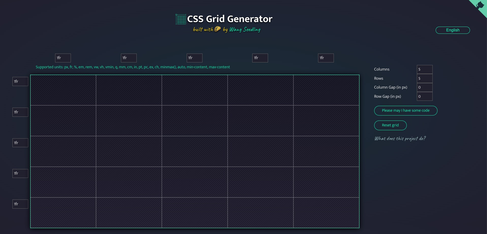

# CSS 网格生成器



中文 | [English](./README.md)

这个项目是让人们快速使用 CSS Grid 功能来创建动态布局的一种方式。


你可以设置你的列和行的数字和单位，我会为你生成一个CSS网格！在框内拖动来创建放置在网格内的div元素。


我注意到很多人没有使用 Grid，因为他们觉得它太复杂了，无法理解。Grid 功能非常强大，而这个小型生成器只触及了其中的一小部分功能。这样做的目的是让人们能够快速上手，并创建更有趣的布局。


当你对这个有所了解后，我建议你去看看以下资源： [Github](https://github.com/wangmiaozero), [Seedling-ui](https://wangmiaozero.github.io/vue3-seedling-ui-website/#/), 和 [ Wang Seddling ](https://www.wangmiaozero.cn) 深入探索。还有一个 [CSS Grid Guide](https://css-tricks.com/snippets/css/complete-guide-grid/) 在 CSS-Tricks 网站上，有一个有趣的小游戏叫做 [Grid Garden](https://cssgridgarden.com/) 帮助你学习更多！

如何这个项目帮助了你，请给一个Star 谢谢!

### 环境要求

```
node v18.20.0
npm v10.5.0
pnpm v9.12.1
```

### 项目设置

依赖下载

```
pnpm install
```

运行

```
pnpm run dev
```

打包

```
pnpm run build
```

eslint

```
pnpm run lint
```

# React 19 + Vite   6 + ESLint

这个模板提供了一个最基本的设置，可以在 Vite 中使用热重载和一些 ESLint 规则来运行 React。本项目利用 React 19 和 Vite 6 的最新版本，将现代前端开发的最佳实践融合到一起，提供了一套功能强大、性能优越、灵活高效的开发模板。它为开发者带来了前所未有的开发体验，并确保项目在未来技术变革中的兼容性与领先性。

目前，有两个官方插件可用：

- [@vitejs/plugin-react](https://github.com/vitejs/vite-plugin-react/blob/main/packages/plugin-react/README.md) 使用 [Babel](https://babeljs.io/) 实现快速刷新。
- [@vitejs/plugin-react-swc](https://github.com/vitejs/vite-plugin-react-swc) 使用 [SWC](https://swc.rs/) 实现快速刷新。


```
cssgridgenerator-react
├─ .gitignore
├─ README.md
├─ eslint.config.js
├─ index.html
├─ package.json
├─ pnpm-lock.yaml
├─ public
│  ├─ favicon.ico
│  ├─ og-cssgrid.jpg
│  └─ vite.svg
├─ src
│  ├─ App.jsx
│  ├─ assets
│  │  └─ react.svg
│  ├─ components
│  │  ├─ AppCode.jsx
│  │  ├─ AppExplain.jsx
│  │  ├─ AppForm.jsx
│  │  ├─ AppGithubCorner.jsx
│  │  ├─ AppGrid.jsx
│  │  ├─ AppHeader.jsx
│  │  ├─ AppLogo.jsx
│  │  └─ AppModal.jsx
│  ├─ i18n
│  │  ├─ bn.json
│  │  ├─ en.json
│  │  ├─ es.json
│  │  ├─ fr.json
│  │  ├─ index.jsx
│  │  ├─ pt.json
│  │  └─ zh.json
│  ├─ main.jsx
│  ├─ store
│  │  ├─ index.js
│  │  └─ slices
│  │     └─ gridSlice.js
│  ├─ styles
│  │  ├─ App.scss
│  │  ├─ components
│  │  │  ├─ AppCode.scss
│  │  │  ├─ AppExplain.scss
│  │  │  ├─ AppForm.scss
│  │  │  ├─ AppGithubCorner.scss
│  │  │  ├─ AppGrid.scss
│  │  │  ├─ AppHeader.scss
│  │  │  ├─ AppLogo.scss
│  │  │  └─ AppModal.scss
│  │  ├─ main.scss
│  │  └─ variables.scss
│  └─ utils
│     ├─ repetition.js
│     └─ repetition.spec.js
└─ vite.config.js

```