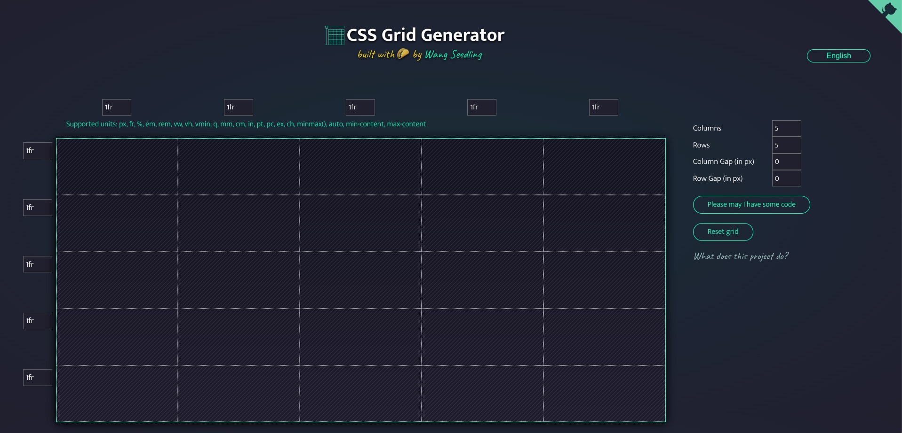

# Генератор CSS Grid

<p align="center">
  <a href="./README.zh-CN.md">简体中文</a> |
  <a href="./README.md">English</a> |
  <a href="./README_ko.md">한국어</a> |
  <a href="./README_fr.md">Français</a> |
  <a href="./README_de.md">Deutsch</a> |
  <a href="./README_ja.md">日本語</a> |
  <strong>Русский</strong> |
  <a href="./README_es.md">Español</a> |
  <a href="./README_pt.md">Português</a> |
  <a href="./README_it.md">Italiano</a> |
  <a href="./README_vi.md">Tiếng Việt</a> |
  <a href="./README_ar.md">العربية</a>
</p>



Этот проект помогает быстро использовать возможности CSS Grid для динамичных макетов.

Задайте количество и единицы столбцов и строк — будет сгенерирован CSS Grid. Перетаскивайте внутри ячеек, чтобы создавать `div` в сетке.

Многие не используют Grid из‑за сложности. У Grid большие возможности; этот небольшой генератор затрагивает лишь часть. Цель — быстрый старт и более интересные макеты.

Когда освоитесь, изучите материалы [Github](https://github.com/wangmiaozero), [Seedling-ui](https://wangmiaozero.github.io/vue3-seedling-ui-website/#/) и [Wang Seddling](https://www.wangmiaozero.cn). Также есть [руководство по CSS Grid](https://css-tricks.com/snippets/css/complete-guide-grid/) на CSS-Tricks и игра [Grid Garden](https://cssgridgarden.com/).

Если проект помог, поставьте звезду репозиторию. Спасибо!

### Требования к окружению

```
node v18.20.0
npm v10.5.0
pnpm v9.12.1
```

### Установка

```
pnpm install
```

Сборка и горячая перезагрузка для разработки

```
pnpm run dev
```

Сборка и минификация для продакшена

```
pnpm run build
```

Линтинг и автоисправления

```
pnpm run lint
```

# React 19 + Vite 6 + ESLint

Шаблон даёт минимальную настройку React в Vite с HMR и правилами ESLint. Используются React 19 и Vite 6 и современные практики фронтенд‑разработки.

Доступны два официальных плагина:

- [@vitejs/plugin-react](https://github.com/vitejs/vite-plugin-react/blob/main/packages/plugin-react/README.md) — Fast Refresh через [Babel](https://babeljs.io/)
- [@vitejs/plugin-react-swc](https://github.com/vitejs/vite-plugin-react-swc) — Fast Refresh через [SWC](https://swc.rs/)


```
cssgridgenerator-react
├─ .gitignore
├─ README.md
├─ eslint.config.js
├─ index.html
├─ package.json
├─ pnpm-lock.yaml
├─ public
│  ├─ favicon.ico
│  ├─ og-cssgrid.jpg
│  └─ vite.svg
├─ src
│  ├─ App.jsx
│  ├─ assets
│  │  └─ react.svg
│  ├─ components
│  │  ├─ AppCode.jsx
│  │  ├─ AppExplain.jsx
│  │  ├─ AppForm.jsx
│  │  ├─ AppGithubCorner.jsx
│  │  ├─ AppGrid.jsx
│  │  ├─ AppHeader.jsx
│  │  ├─ AppLogo.jsx
│  │  └─ AppModal.jsx
│  ├─ i18n
│  │  ├─ bn.json
│  │  ├─ en.json
│  │  ├─ es.json
│  │  ├─ fr.json
│  │  ├─ index.jsx
│  │  ├─ pt.json
│  │  └─ zh.json
│  ├─ main.jsx
│  ├─ store
│  │  ├─ index.js
│  │  └─ slices
│  │     └─ gridSlice.js
│  ├─ styles
│  │  ├─ App.scss
│  │  ├─ components
│  │  │  ├─ AppCode.scss
│  │  │  ├─ AppExplain.scss
│  │  │  ├─ AppForm.scss
│  │  │  ├─ AppGithubCorner.scss
│  │  │  ├─ AppGrid.scss
│  │  │  ├─ AppHeader.scss
│  │  │  ├─ AppLogo.scss
│  │  │  └─ AppModal.scss
│  │  ├─ main.scss
│  │  └─ variables.scss
│  └─ utils
│     ├─ repetition.js
│     └─ repetition.spec.js
└─ vite.config.js

```

## Лицензия

Проект распространяется на условиях **[Creative Commons Attribution-NonCommercial 4.0 International (CC BY-NC 4.0)](https://creativecommons.org/licenses/by-nc/4.0/)**.

### Кратко:
- **Разрешено**:
  - Делиться — копировать и распространять материал в любом формате.
  - Адаптировать — перерабатывать и создавать производные работы.

- **На условиях**:
  - **Указание авторства** — указать авторство, дать ссылку на лицензию и отметить изменения. Допустимым способом, без намёка на одобрение лицензиаром.
  - **Некоммерческое использование** — нельзя использовать в коммерческих целях.

Подробности — в файле [LICENSE](LICENSE) в репозитории.
